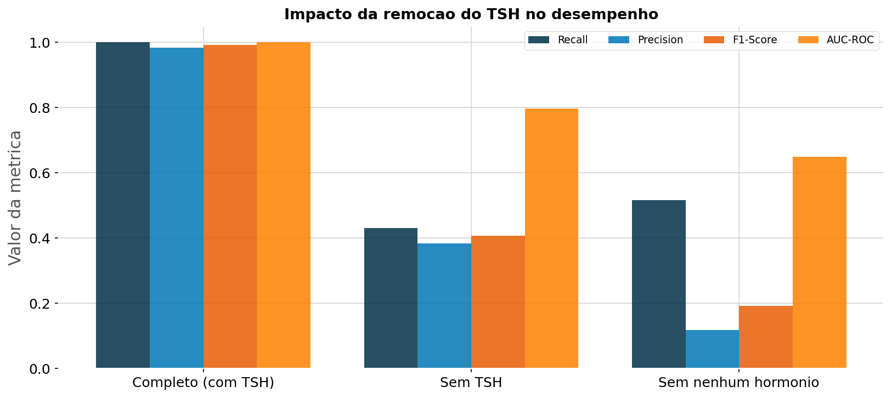
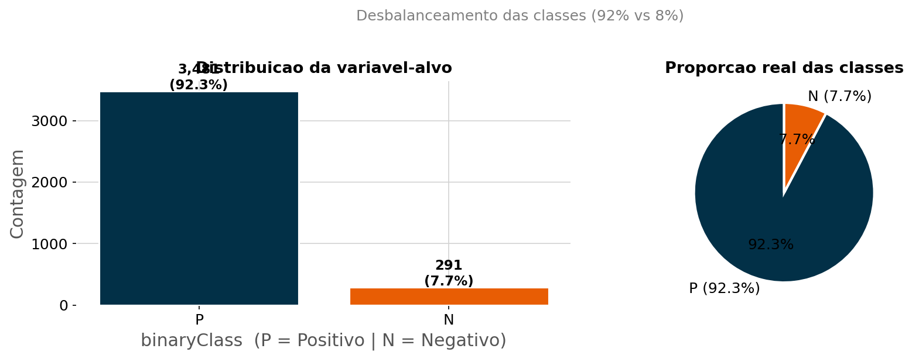
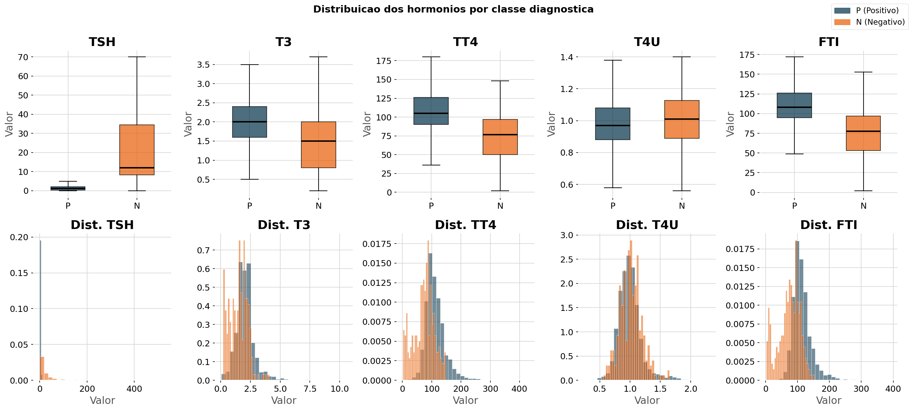
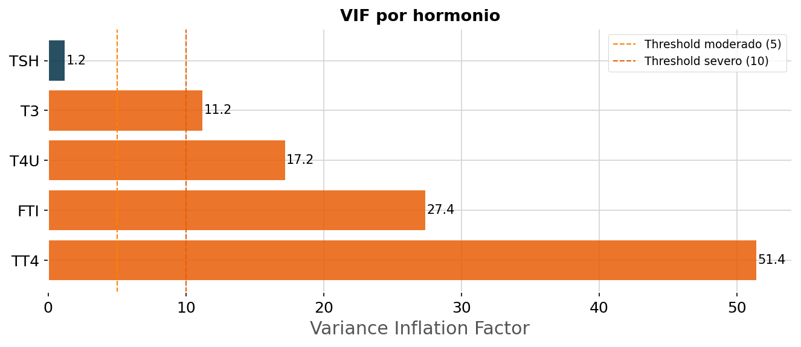
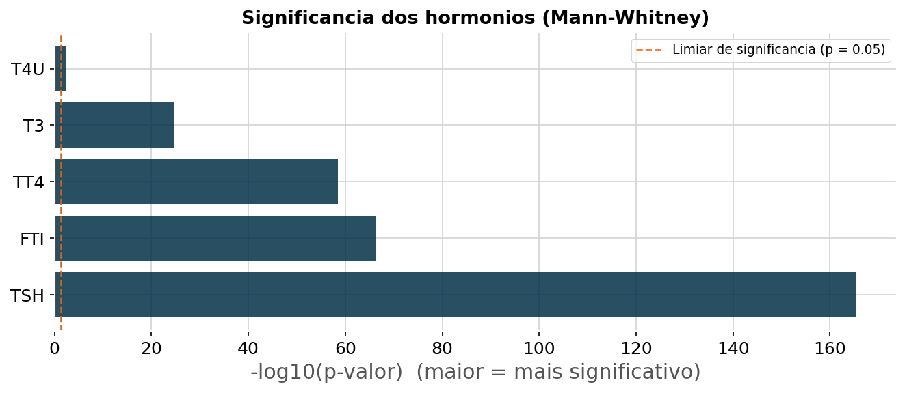
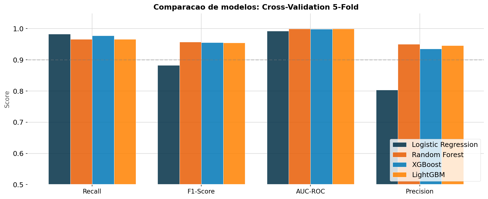
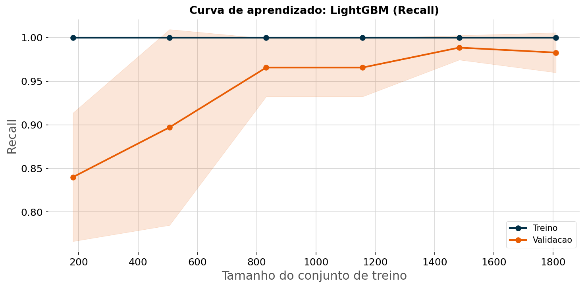
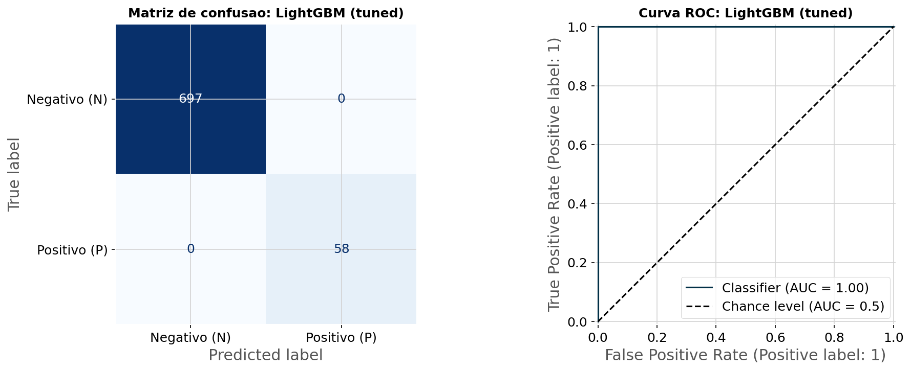
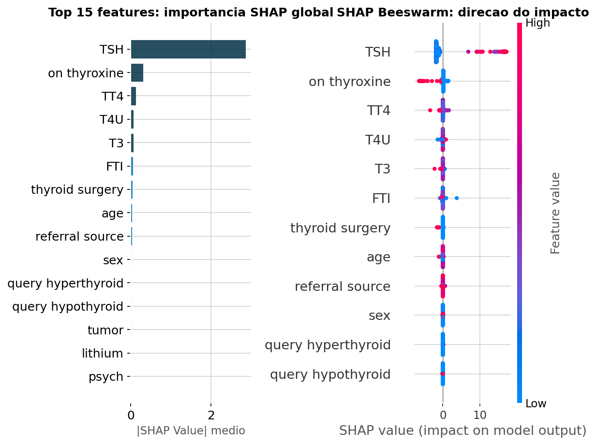

# 🦋 Diagnóstico de Hipotireoidismo com Machine Learning


> Modelo de classificação binária que identifica hipotireoidismo a partir de exames hormonais e histórico clínico, com **Recall de 100%** na classe de doentes. Mais importante que o resultado: o projeto **audita criticamente o próprio desempenho**, investigando e explicando por que as métricas são tão altas.

---

## Resultado em uma frase

Treinado sobre 3.772 registros de pacientes, o modelo detecta praticamente todos os casos de hipotireoidismo. Mas o verdadeiro diferencial do projeto não é o número perfeito, e sim a investigação honesta que prova **por que** ele é legítimo e onde está sua fragilidade real.

| Métrica | Valor | Significado clínico |
|---|---|---|
| Recall (doentes) | ~100% | Praticamente nenhum paciente doente fica sem diagnóstico |
| Precision | ~98-100% | Quase todos os alertas são casos reais |
| F1-Score | ~0.99 | Forte equilíbrio entre sensibilidade e precisão |
| AUC-ROC | ~1.00 | Separação entre classes próxima do ideal teórico |

---

## Sobre o projeto

O hipotireoidismo é uma das condições mais subdiagnosticadas no mundo. A tireoide, quando falha, desregula silenciosamente o metabolismo, o humor e a função cardíaca. Em um cenário clínico, o risco mais grave não é diagnosticar um saudável como doente (gera um exame extra), e sim deixar um doente sair sem diagnóstico. Em machine learning, isso é um **Falso Negativo**, e minimizá-lo guiou cada decisão técnica deste projeto.

O trabalho segue a metodologia **CRISP-DM** de ponta a ponta, com foco em duas coisas que distinguem um projeto maduro: **fundamentação estatística** de cada decisão e **honestidade científica** sobre os resultados.

**Dataset:** 3.772 pacientes, 29 variáveis (hormonais, demográficas, clínicas). Classe doente (N) representa 8% dos casos, saudável (P) representa 92%.

---

## ⭐ O diferencial: auditoria do desempenho

Resultado quase perfeito em um problema clínico real é motivo de **desconfiança**, não de comemoração. Pode indicar vazamento de dados, erro de avaliação, ou um problema fundamentalmente fácil. Este projeto investiga qual é o caso.

A descoberta: o **TSH sozinho separa as classes quase perfeitamente**. 99,3% dos doentes têm TSH elevado, contra apenas 2,2% dos saudáveis. Isso faz sentido clínico, o TSH é o exame que define o diagnóstico na prática médica.

Para provar isso, treinamos o modelo em três cenários:

| Cenário | Recall | Precision | F1-Score | AUC-ROC |
|---|---|---|---|---|
| **Completo (com TSH)** | 1.00 | 0.98 | 0.99 | 1.00 |
| **Sem TSH** | 0.41 | 0.41 | 0.41 | 0.82 |
| **Sem nenhum hormônio** | 0.41 | 0.12 | 0.18 | 0.68 |

O F1 despenca de 0.99 para 0.41 sem o TSH. Isso **prova** que o desempenho não é vazamento técnico, é a dominância clínica legítima do TSH. Uma segunda verificação confirma a robustez: as colunas que indicam se cada exame foi solicitado foram removidas, e o modelo manteve o desempenho idêntico, ou seja, ele se apoia nos valores hormonais reais, não em atalhos.



A conclusão de negócio é direta: a qualidade do exame de TSH é crítica para o modelo. Se esse dado falhar ou vier ausente, a capacidade preditiva cai pela metade.

---

## Metodologia CRISP-DM

### 1. Entendimento do Negócio

Define-se Recall como métrica principal, pelo alto custo clínico do falso negativo. A acurácia é descartada: com 92% de pacientes saudáveis, um modelo que classificasse todos como saudáveis teria 92% de acurácia e seria inútil.

### 2. Entendimento dos Dados

Exploração visual combinada com diagnóstico estatístico formal.

**Desbalanceamento das classes** — apenas 8% dos pacientes são doentes.



**Distribuição hormonal por classe** — hormônios claramente distintos entre doentes e saudáveis.



**Diagnóstico de multicolinearidade (VIF)** — confirma que TT4, FTI e T4U carregam informação sobreposta (o FTI é calculado a partir dos outros dois). VIF de TT4 chega a 51.



**Significância estatística** — teste de Mann-Whitney para os hormônios e qui-quadrado para as variáveis clínicas. O TSH aparece como o preditor mais significativo, com folga enorme sobre os demais.



### 3. Preparação dos Dados

Decisões fundamentadas nos diagnósticos: imputação da mediana feita **após o split** (evitando data leakage), manutenção dos outliers hormonais (um TSH de 500 não é ruído, é o diagnóstico), e remoção das colunas que indicam se o exame foi solicitado (conceitualmente problemáticas e não usadas pelo modelo).

### 4. Modelagem

Quatro modelos comparados em validação cruzada estratificada: Regressão Logística, Random Forest, XGBoost e LightGBM. O LightGBM venceu, com hiperparâmetros otimizados via RandomizedSearchCV usando F2-Score (que prioriza Recall, coerente com a meta clínica).

**Validação cruzada** — confirma estabilidade do desempenho entre diferentes divisões.



**Curva de aprendizado** — as curvas de treino e validação convergem com gap mínimo, indicando modelo bem calibrado para o volume de dados disponível.



### 5. Avaliação

O modelo campeão é avaliado contra o objetivo de negócio, com camadas extras de rigor.

**Matriz de confusão** — traduz o desempenho em acertos e erros concretos.



**Interpretabilidade com SHAP** — confirma que o modelo aprendeu biologia, não ruído: TSH no topo, seguido pelos hormônios tireoidianos diretos. O modelo é auditável, não uma caixa preta.



A avaliação inclui ainda **intervalo de confiança via bootstrap** (reportando a faixa das métricas em vez de um número seco), a **otimização do threshold via validação cruzada no treino** (nunca no teste) e a **seção de auditoria** descrita acima.

### 6. Implantação

Considerações para produção: validação externa em dados de outros hospitais, calibração de probabilidade, monitoramento de data drift e, sobretudo, garantia da qualidade do dado de TSH, identificado como crítico na auditoria.

---

## 🔍 Top 5 Features Mais Decisivas (SHAP)

1. **TSH** — Nível elevado é o indicador primário. A hipófise grita quando a tireoide silencia.
2. **TT4 / T3** — Hormônios tireoidianos produzidos diretamente pela glândula.
3. **FTI** — Índice de Tiroxina Livre, medida derivada de alta relevância clínica.
4. **Idade** — O risco aumenta significativamente após os 50 anos.
5. **On Thyroxine** — Pacientes já em reposição hormonal apresentam padrões fisiológicos distintos.

---

## ⚠️ Limitações e Próximos Passos

Este modelo é uma prova de conceito robusta, não um sistema pronto para produção. Antes de qualquer uso clínico real:

- **Validação externa:** testar em dados de outros hospitais para avaliar generalização
- **Dependência do TSH:** a auditoria revelou que o modelo depende criticamente desse exame
- **Calibração de probabilidade:** garantir que "70% de risco" signifique de fato 70%
- **Aprovação regulatória:** sistemas de apoio à decisão clínica exigem validação por autoridades competentes

---

## 🛠️ Stack Técnica

| Categoria | Ferramentas |
|---|---|
| Linguagem | Python 3.10 |
| Manipulação de Dados | Pandas, NumPy |
| Visualização | Matplotlib, Seaborn |
| Machine Learning | Scikit-learn, XGBoost, LightGBM |
| Estatística | statsmodels, SciPy |
| Interpretabilidade | SHAP |
| Ambiente | Jupyter Notebook |

---

## ▶️ Como Executar

```bash
# Clone o repositório
git clone https://github.com/oporaxuao/hypothyroidism-diagnosis-crisp-dm.git
cd hypothyroidism-diagnosis-crisp-dm

# Instale as dependências
pip install pandas numpy matplotlib seaborn scikit-learn xgboost lightgbm statsmodels scipy shap jupyter

# Inicie o notebook
jupyter notebook hypothyroid-CRISP-DM.ipynb
```

Recomenda-se executar com `Kernel > Restart & Run All` para gerar todos os gráficos na pasta `images/` e reproduzir os resultados na ordem correta.

---

## 👤 Autor

**João Alfredo de Sousa Siqueira**

[](https://linkedin.com/in/oporaxuao)
[](https://github.com/oporaxuao)
